<div align="center">

# 🔄 CRM Automation Frameworks

### Practical CRM Architecture, Lead Management & Revenue Workflow Systems

**CRM Strategy · Lead Lifecycle · Data Model · Pipeline · Routing · Follow-Up · Attribution · Reporting**

A public knowledge repository for designing **structured, reliable and measurable CRM systems** that connect acquisition, customer data, sales workflows and revenue operations.

<br>

[](crm-strategy-framework.md)
[](crm-lead-routing-framework.md)
[](crm-pipeline-design-framework.md)
[](crm-attribution-framework.md)
[](crm-automation-qa-checklist.md)

<br>

**Created and maintained by [Prashant Rajput](https://github.com/prashant6788)**  
Founder, [Touchstone Infotech](https://www.touchstoneinfotech.com/)

</div>

---

## 🧭 Start Here

If you are designing or rebuilding a CRM system, follow this path:

**1. [CRM Strategy Framework](crm-strategy-framework.md)**  
Define the business process, CRM responsibilities, source of truth and operating model.

**2. [Lead Lifecycle Framework](lead-lifecycle-framework.md)**  
Define how contacts move from enquiry through qualification, opportunity, won/lost and re-engagement.

**3. [CRM Data Model Framework](crm-data-model-framework.md)**  
Design contacts, opportunities, fields, controlled values, duplicate rules and data ownership.

**4. [CRM Pipeline Design Framework](crm-pipeline-design-framework.md)**  
Turn the sales process into meaningful, measurable opportunity stages.

**5. [CRM Lead Routing Framework](crm-lead-routing-framework.md)**  
Define assignment, ownership, routing precedence, reassignment and fallback.

**6. [CRM Follow-Up Framework](crm-follow-up-framework.md)**  
Design structured follow-up with human ownership, timing and stop conditions.

**7. [CRM Automation QA Checklist](crm-automation-qa-checklist.md)**  
Test the complete system before production deployment.

---

# 🧩 CRM Operating Architecture

```mermaid
flowchart LR
    A["Lead Sources"] --> B["Capture + Validation"]
    B --> C["CRM Contact"]
    C --> D["Ownership + Qualification"]
    D --> E["Opportunity"]
    E --> F["Pipeline"]
    F --> G["Follow-Up / Appointment"]
    G --> H["Sales Activity"]
    H --> I["Won / Lost"]
    I --> J["Revenue + Attribution"]
    J --> K["Reporting"]
```



A CRM should answer five operational questions:

> **Where did the lead come from? Who owns it? What should happen next? Where is the opportunity now? What business outcome resulted?**

---

# 📚 Core Framework Library

| | Resource | Best For |
|---|---|---|
| 🧭 | **[CRM Strategy Framework](crm-strategy-framework.md)** | Overall CRM architecture and operating principles |
| 🔄 | **[Lead Lifecycle Framework](lead-lifecycle-framework.md)** | Contact, lead, opportunity and customer lifecycle |
| 🗂️ | **[CRM Data Model Framework](crm-data-model-framework.md)** | Fields, entities, controlled values and data governance |
| 📈 | **[CRM Pipeline Design Framework](crm-pipeline-design-framework.md)** | Meaningful sales stages and pipeline governance |
| 🎯 | **[CRM Lead Routing Framework](crm-lead-routing-framework.md)** | Assignment, ownership, routing and fallback |
| 🔁 | **[CRM Follow-Up Framework](crm-follow-up-framework.md)** | Follow-up sequences, timing and stop conditions |
| 📅 | **[CRM Appointment Automation Framework](crm-appointment-automation-framework.md)** | Booking, reminders, rescheduling and no-show recovery |
| 🔎 | **[CRM Attribution Framework](crm-attribution-framework.md)** | Original source, latest source, campaigns and revenue attribution |
| 📊 | **[CRM Reporting Framework](crm-reporting-framework.md)** | Operational, funnel, pipeline and revenue reporting |

---

# 🧰 Practical Templates & Checklists

| | Resource | Use It For |
|---|---|---|
| 🧹 | **[CRM Data Quality Checklist](crm-data-quality-checklist.md)** | Auditing duplicates, missing data, ownership and attribution |
| 🔍 | **[CRM Automation Opportunity Worksheet](crm-automation-opportunity-worksheet.md)** | Deciding which CRM processes should be automated |
| 📝 | **[CRM Workflow Specification Template](crm-workflow-specification-template.md)** | Documenting implementation-ready workflows |
| 🧪 | **[CRM Automation QA Checklist](crm-automation-qa-checklist.md)** | Testing routing, pipeline, integrations and failure paths |

---

# 🧪 Implementation Example

### [Open the CRM Automation Implementation Example →](crm-automation-example.md)

The repository includes a fictional, sanitized B2B services example showing how the frameworks can work together:

```text
Lead Source
↓
Capture
↓
Validation
↓
Duplicate Check
↓
CRM Contact
↓
Ownership
↓
Qualification
↓
Opportunity
↓
Appointment / Discovery
↓
Pipeline
↓
Won / Lost
↓
Attribution
↓
Reporting
```

The example is illustrative and does **not** represent a specific Touchstone Infotech client or claim real-world performance results.

---

# 🎯 What This Repository Covers

## CRM Strategy & Architecture

`Business Process` · `System of Record` · `Lifecycle` · `Ownership` · `Governance` · `Integrations`

## Lead Management

`Capture` · `Validation` · `Duplicates` · `Qualification` · `Assignment` · `Routing` · `Reassignment`

## Pipeline & Revenue Operations

`Opportunities` · `Pipeline Stages` · `Stage Aging` · `Won/Lost` · `Sales Cycle` · `Revenue`

## Follow-Up & Appointments

`Tasks` · `Automated Follow-Up` · `Stop Conditions` · `Booking` · `Reminders` · `No-Show Recovery`

## Attribution & Reporting

`Original Source` · `Latest Source` · `Campaigns` · `Pipeline Reporting` · `Revenue Attribution` · `Data Quality`

## Reliability & QA

`Idempotency` · `Duplicate Events` · `API Failures` · `Fallbacks` · `Logging` · `Monitoring` · `Rollback`

---

# 🔄 From Lead Capture to Revenue

```text
ACQUISITION
     ↓
Lead Capture
     ↓
Validation
     ↓
CRM Record
     ↓
Ownership
     ↓
Qualification
     ↓
Opportunity
     ↓
Pipeline
     ↓
Follow-Up / Appointment
     ↓
Sales Outcome
     ↓
Won / Lost
     ↓
Revenue + Attribution
     ↓
Management Reporting
```

The objective is not to automate every sales interaction.

The objective is to make the customer journey **structured, accountable and measurable**.

---

# 🧠 CRM Design Principles

### 1. Process Before Platform

Define the business process before configuring software.

### 2. CRM as the Operational System of Record

Important customer and sales states should have a clearly defined authoritative system.

### 3. Clear Ownership

Every actionable lead and opportunity should have an accountable owner.

### 4. Meaningful Pipeline Stages

Pipeline stages should represent commercial progress rather than ordinary activities such as calls or emails.

### 5. Automate Stable Rules

Use automation for repeatable decisions and actions. Keep judgment, negotiation and exceptions with people.

### 6. Preserve Attribution

Keep original acquisition information while tracking later acquisition events separately.

### 7. Design Failure Paths

Production workflows should define what happens when data is missing, integrations fail, duplicate events arrive or no routing rule matches.

### 8. Measure Outcomes

CRM reporting should connect operational activity to qualification, opportunities, pipeline and revenue.

---

# 🗂️ CRM Data Model

A practical CRM often separates information into different business entities.

```text
Contact
│
├── Identity
├── Acquisition
├── Qualification
└── Relationship
        │
        ↓
Opportunity
│
├── Owner
├── Pipeline
├── Stage
├── Value
├── Expected Close
└── Won / Lost
        │
        ↓
Activities + Appointments
        │
        ↓
Revenue + Reporting
```

Avoid using contact-level custom fields to store every piece of opportunity-specific or transactional information.

See the **[CRM Data Model Framework](crm-data-model-framework.md)**.

---

# 🎯 Lead Routing Model

```text
New Lead
↓
Validate
↓
Check Existing Contact
↓
Check Existing Owner / Opportunity
↓
Apply Routing Rules
↓
Assign Owner
↓
Create Next Action
↓
Verify Assignment
↓
Fallback if Required
```

A lead should never disappear simply because no routing rule matched.

See the **[CRM Lead Routing Framework](crm-lead-routing-framework.md)**.

---

# 📈 Pipeline Philosophy

A pipeline is not a task list.

A practical sales pipeline might look like:

```text
New Opportunity
↓
Qualified
↓
Discovery / Meeting
↓
Proposal / Commercial
↓
Decision
↓
Won / Lost
```

Activities such as **Called**, **Email Sent** or **WhatsApp Sent** are usually better tracked as activities rather than pipeline stages.

See the **[CRM Pipeline Design Framework](crm-pipeline-design-framework.md)**.

---

# 🔁 Follow-Up With Stop Conditions

Automated follow-up should react to changes in CRM state.

```text
Follow-Up Sequence
        ↓
Customer Replies? ── Yes ──→ Pause / Human Owner
        ↓ No
Appointment Booked? ─ Yes ──→ Stop Conflicting Follow-Up
        ↓ No
Won / Lost / Disqualified? ─ Yes ──→ Exit
        ↓ No
Continue Defined Sequence
```

This helps prevent contradictory or unnecessary communication.

See the **[CRM Follow-Up Framework](crm-follow-up-framework.md)**.

---

# 📊 Measurement Philosophy

Do not evaluate a CRM only using:

```text
Calls Made
Messages Sent
Tasks Created
Workflow Runs
```

Measure the customer and revenue process:

```text
Leads
↓
Assignment
↓
Engagement
↓
Qualification
↓
Opportunities
↓
Appointments
↓
Pipeline
↓
Won / Lost
↓
Revenue
```

Operational metrics such as workflow failures, duplicate rate, missing ownership and unknown attribution should be monitored alongside funnel metrics.

See the **[CRM Reporting Framework](crm-reporting-framework.md)**.

---

# 🤖 CRM + AI

AI can assist CRM operations, but it does not need to become the CRM's system of record.

Useful AI-assisted tasks may include:

- Enquiry interpretation
- Information extraction
- Conversation summarization
- Suggested classification
- Lead qualification assistance
- Recommended next actions

For deeper AI workflow design, see **[AI Automation Playbooks](https://github.com/prashant6788/ai-automation-playbooks)**.

This repository intentionally focuses primarily on **CRM architecture and deterministic revenue workflows**.

---

# 🏗️ Repository Structure

```text
crm-automation-frameworks/
│
├── README.md
├── CONTRIBUTING.md
│
├── crm-strategy-framework.md
├── lead-lifecycle-framework.md
├── crm-data-model-framework.md
├── crm-pipeline-design-framework.md
├── crm-lead-routing-framework.md
├── crm-follow-up-framework.md
├── crm-appointment-automation-framework.md
├── crm-attribution-framework.md
├── crm-reporting-framework.md
│
├── crm-data-quality-checklist.md
├── crm-automation-opportunity-worksheet.md
├── crm-workflow-specification-template.md
├── crm-automation-qa-checklist.md
│
└── crm-automation-example.md
```

---

# 🔗 Related Repositories

### 🤖 [AI Automation Playbooks](https://github.com/prashant6788/ai-automation-playbooks)

Practical frameworks for AI strategy, workflow design, CRM + AI, human handoff, QA and measurement.

### 🔎 [SEO Growth Systems](https://github.com/prashant6788/seo-growth-systems)

Practical frameworks for SEO, GEO and visibility across traditional and AI-powered search.

---

# 👤 About the Maintainer

## Prashant Rajput

Founder of [Touchstone Infotech](https://www.touchstoneinfotech.com/).

I work across:

**AI · Automation · CRM · SEO/GEO · Performance Marketing · System Integration**

My focus is building practical systems that connect:

**Lead Generation → CRM → Automation → Sales Operations → Revenue Measurement**

### Experience

- **13+ years** in digital growth and technology
- **300+ businesses** supported
- Experience across **India, USA, UK, Canada & Australia**
- Experience managing **₹2–3 Cr+ in annual media spend**
- Leading a growth and technology team at Touchstone Infotech

### Connect

🌐 [Touchstone Infotech](https://www.touchstoneinfotech.com/)  
💼 [LinkedIn – Prashant Rajput](https://www.linkedin.com/in/prashant6788/)  
👤 [GitHub – Prashant Rajput](https://github.com/prashant6788)

---

# 🗺️ V1 Status

## Core CRM Architecture

- [x] CRM Strategy Framework
- [x] Lead Lifecycle Framework
- [x] CRM Data Model Framework
- [x] CRM Pipeline Design Framework

## Revenue Operations

- [x] CRM Lead Routing Framework
- [x] CRM Follow-Up Framework
- [x] CRM Appointment Automation Framework
- [x] CRM Attribution Framework
- [x] CRM Reporting Framework

## Operations & QA

- [x] CRM Data Quality Checklist
- [x] CRM Automation Opportunity Worksheet
- [x] CRM Workflow Specification Template
- [x] CRM Automation QA Checklist

## Proof of Application

- [x] Sanitized CRM Automation Implementation Example

## Repository Governance

- [x] CONTRIBUTING.md
- [ ] LICENSE

---

# 🤝 Contributing

Corrections, practical implementation improvements and useful CRM edge cases are welcome.

Please read **[CONTRIBUTING.md](CONTRIBUTING.md)** before contributing.

Useful contributions include improvements to:

- Lead lifecycle design
- Routing and ownership
- Pipeline architecture
- Data quality
- Follow-up stop conditions
- Appointment workflows
- Attribution
- Reporting
- Integration failure handling
- CRM QA

Please avoid promotional backlinks, generic filler, fabricated statistics, fake case studies, confidential data and credentials.

---

# ⚠️ Important Note

CRM platforms, APIs, advertising systems, calendars, messaging platforms and integration behavior change over time.

These resources are intended as **practical working frameworks**, not guarantees of:

- CRM performance
- Conversion improvement
- Revenue growth
- Platform compatibility
- Attribution completeness
- Regulatory compliance

Production implementations should be evaluated against current vendor documentation, business requirements, security/privacy requirements and real-world testing.

---

<div align="center">

## 🔄 CRM Automation Frameworks

**CRM Strategy · Lifecycle · Data · Pipeline · Routing · Follow-Up · Attribution · Reporting**

Maintained by **[Prashant Rajput](https://github.com/prashant6788)**  
Founder, **[Touchstone Infotech](https://www.touchstoneinfotech.com/)**

[LinkedIn](https://www.linkedin.com/in/prashant6788/) · [GitHub](https://github.com/prashant6788) · [Touchstone Infotech](https://www.touchstoneinfotech.com/)

</div>
