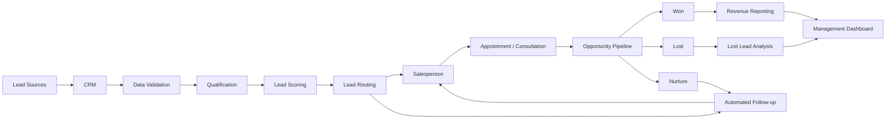

# CRM Automation Frameworks

### Practical CRM Architecture, Lead Management & Revenue Workflow Systems

A public knowledge repository by **Prashant Rajput**, Founder of [Touchstone Infotech](https://www.touchstoneinfotech.com/), focused on designing CRM systems that connect marketing, customer communication, sales processes and revenue operations.

This repository documents practical frameworks, workflow architectures and implementation approaches for building CRM systems that go beyond contact storage.

The objective is to create:

**Lead Capture → Qualification → Routing → Follow-up → Opportunity Management → Conversion → Reporting**

---

## What This Repository Covers

### 🎯 Lead Management
- Lead capture
- Lead-source tracking
- Lead qualification
- Lead scoring
- Lead routing
- Duplicate management
- Sales assignment
- Lead ownership

### 🔁 CRM Automation
- Workflow triggers
- Automated follow-up
- Pipeline automation
- Opportunity creation
- Stage management
- Task automation
- Internal notifications
- Re-engagement workflows

### 💬 Customer Communication
- WhatsApp automation
- Email automation
- SMS workflows
- Appointment reminders
- Missed-call follow-up
- Multi-channel communication
- Human handoff

### 📊 Revenue Operations
- Marketing-to-sales handoff
- Pipeline visibility
- Conversion tracking
- Lead-source attribution
- Sales response monitoring
- Funnel reporting
- Revenue dashboards
- Lost-lead analysis

### 🔌 System Integration
- CRM integrations
- API integrations
- Lead-source integrations
- Advertising platform connections
- Calendar integrations
- Payment integrations
- Reporting integrations
- AI-assisted workflows

---

## Frameworks & Resources

Resources will be published as they are completed and validated.

| Resource | Status |
|---|---|
| CRM Lead Routing Framework | 🚧 Building |
| CRM Pipeline Architecture | 📌 Planned |
| Lead Lifecycle Framework | 📌 Planned |
| Marketing-to-Sales Handoff Framework | 📌 Planned |
| CRM Data & Custom Fields Framework | 📌 Planned |
| Lost Lead Recovery Workflow | 📌 Planned |
| CRM Reporting Framework | 📌 Planned |
| Multi-Channel Follow-up Framework | 📌 Planned |

Rather than creating empty folders, resources will be added when there is useful implementation material to publish.

---

## CRM Architecture

A CRM should function as the central operational layer between acquisition and revenue.



The CRM becomes the system connecting:

**Marketing → Customer Data → Automation → Sales → Revenue**

---

## My Approach

A CRM implementation should answer five basic questions.

### 1. Where did the lead come from?

Every enquiry should have useful source information wherever technically possible.

### 2. Who owns the lead?

A lead without clear ownership can easily become a lost opportunity.

### 3. What should happen next?

The system should create the appropriate task, communication, appointment or workflow.

### 4. Where is the opportunity in the sales process?

Pipeline stages should represent meaningful business outcomes rather than arbitrary labels.

### 5. Can management measure the result?

The system should connect acquisition activity with sales outcomes and revenue wherever possible.

---

## CRM Should Not Be a Contact Database

A common CRM implementation looks like:

```text
Lead
  ↓
Contact Record
  ↓
Salesperson Manually Checks CRM
```

A connected CRM system should look more like:

```text
Lead Source
     ↓
CRM
     ↓
Qualification
     ↓
Assignment
     ↓
Automated Acknowledgement
     ↓
Sales Follow-up
     ↓
Opportunity
     ↓
Pipeline
     ↓
Won / Lost / Nurture
     ↓
Reporting
```

The difference is **operational design**.

---

## Lead Sources

A CRM may receive enquiries from:

- Website forms
- Landing pages
- Google Ads
- Meta Ads
- LinkedIn
- WhatsApp
- Phone calls
- Chat systems
- Referral sources
- Ecommerce platforms
- Offline campaigns
- Marketplace platforms
- API integrations

Where possible, the original source should remain attached to the contact and opportunity.

---

## CRM + AI

AI can support CRM operations without becoming the system of record.

Useful applications include:

- Interpreting enquiries
- Lead qualification
- Conversation summarization
- Lead prioritization
- Identifying missing information
- Suggested responses
- Sales call summaries
- Recommended next actions
- Data classification

A useful architecture is:

```text
CRM Data
   ↓
AI Interpretation
   ↓
Structured Output
   ↓
CRM Fields
   ↓
Automation Rules
   ↓
Human Action
```

The CRM stores operational truth.

AI helps interpret information.

Automation executes repeatable actions.

Humans handle judgment and important conversations.

---

## Human + Automation Model

I prefer a hybrid model:

**Automation handles repetition.**

**AI assists with interpretation and prioritization.**

**Humans handle judgment, relationships and important sales conversations.**

Good CRM automation should make teams more effective rather than make customer interactions unnecessarily robotic.

---

## Industry Applications

The frameworks in this repository can be adapted for:

`SaaS` · `Real Estate` · `Education` · `Ecommerce` · `Clinics` · `Local Businesses`

Qualification rules, pipeline stages and automation logic should be adapted to the actual customer journey of each business.

---

## Related Repositories

### 🤖 AI & Automation

[AI Automation Playbooks](https://github.com/prashant6788/ai-automation-playbooks)

Practical AI integration, lead qualification and business automation frameworks.

### 🔎 SEO, GEO & AI Search

[SEO Growth Systems](https://github.com/prashant6788/seo-growth-systems)

Practical frameworks for SEO, GEO and visibility across AI-powered discovery platforms.

---

## About Me

I'm **Prashant Rajput**, Founder of [Touchstone Infotech](https://www.touchstoneinfotech.com/).

I work across **AI, automation, CRM, SEO/GEO, performance marketing and system integration**, building practical systems that connect marketing activity with measurable business outcomes.

- 13+ years in digital growth and technology
- 300+ businesses supported
- Experience across India, USA, UK, Canada & Australia
- ₹2–3 Cr+ annual media spend managed
- Leading a 26-person growth and technology team

---

## Connect

🌐 [Touchstone Infotech](https://www.touchstoneinfotech.com/)  
💼 [LinkedIn – Prashant Rajput](https://www.linkedin.com/in/prashant6788/)  
👤 [GitHub – Prashant Rajput](https://github.com/prashant6788)

---

## Repository Roadmap

This repository is an evolving collection of practical CRM and revenue workflow resources.

New frameworks will be added as they are developed and validated through practical implementation.

If you find the resources useful, consider **starring the repository** to follow future updates.

---

**Maintained by [Prashant Rajput](https://github.com/prashant6788) · Founder, [Touchstone Infotech](https://www.touchstoneinfotech.com/)**
