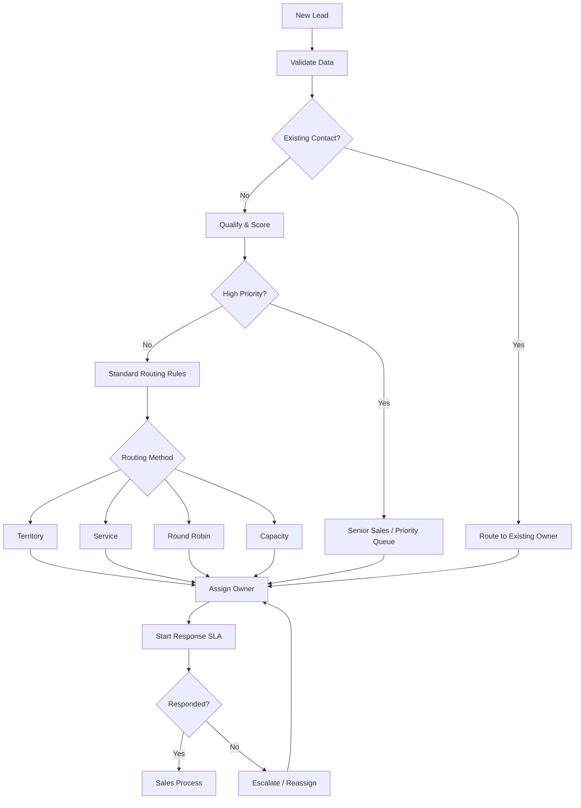
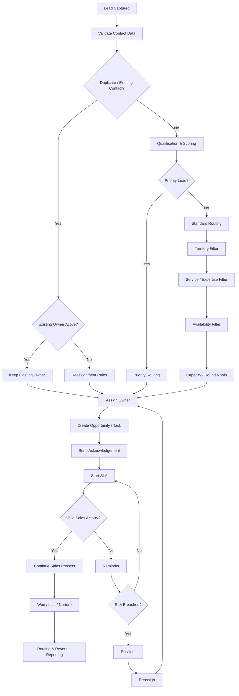

# CRM Lead Routing Framework

### A Practical Framework for Assigning, Prioritizing, Escalating and Reassigning Leads in CRM Systems

Lead routing is the operational layer that determines **who should receive a lead, when they should receive it, and what should happen if they do not act**.

A good routing system reduces response delays, prevents leads from being forgotten and creates clear ownership across marketing and sales.

> Maintained by [Prashant Rajput](https://github.com/prashant6788)  
> Founder, [Touchstone Infotech](https://www.touchstoneinfotech.com/)

---

## 1. Objective

A CRM lead routing framework should answer:

- Where did the lead come from?
- Is this a new or existing contact?
- Is the lead qualified?
- How important is the opportunity?
- Which team should handle it?
- Which salesperson should own it?
- How quickly should someone respond?
- What happens if the assigned person is unavailable?
- What happens if the salesperson does not respond?
- When should the lead be escalated or reassigned?
- How should the routing outcome be measured?

The objective is:

**Right Lead → Right Owner → Right Time → Right Follow-up → Measurable Outcome**

---

## 2. Core Routing Architecture



A routing system should not stop at assignment. It should continue monitoring ownership, response and outcome.

---

## 3. Routing Inputs

Routing decisions can use information such as:

- Lead source
- Campaign
- Product or service
- Location
- Territory
- Language
- Budget
- Lead score
- Intent
- Customer type
- Company size
- Existing contact owner
- Existing opportunity
- Salesperson expertise
- Salesperson availability
- Current salesperson workload
- Business hours
- Appointment type
- Account value
- Customer lifecycle stage

Use only inputs that genuinely improve the routing decision.

---

## 4. Routing Hierarchy

Routing rules need a defined order.

A practical hierarchy may be:

```text
1. Existing Customer / Contact Ownership
2. Strategic or High-Value Lead Rules
3. Territory / Location Rules
4. Product or Service Rules
5. Specialist / Expertise Rules
6. Availability / Capacity Rules
7. Round Robin
8. Default Queue
```

The exact hierarchy depends on the business.

Without a defined priority order, multiple automation rules can compete for the same lead.

---

## 5. Existing Owner Routing

Before assigning a new owner, check whether the contact already exists.

Example:

```text
New Enquiry
    ↓
Search CRM
    ↓
Existing Contact?
    ↓
Yes
    ↓
Existing Owner Active?
    ↓
Yes → Keep Existing Owner
No  → Reassignment Logic
```

This helps prevent:

- Duplicate ownership
- Multiple salespeople contacting the same customer
- Broken relationship continuity
- Conflicting opportunities
- Attribution confusion

Existing ownership should not always override every rule. Strategic account or reassignment policies may take priority.

---

## 6. Round-Robin Routing

Round robin distributes leads sequentially among eligible salespeople.

Example:

```text
Lead 1 → Salesperson A
Lead 2 → Salesperson B
Lead 3 → Salesperson C
Lead 4 → Salesperson A
```

Round robin works well when:

- Salespeople perform similar roles
- Territories are not important
- Lead complexity is similar
- Workload should be distributed fairly

### Limitations

Basic round robin may fail when:

- Someone is on leave
- One salesperson already has excessive workload
- A lead requires specialist knowledge
- Lead values vary significantly
- Salespeople work different shifts

A better implementation uses **eligible round robin**, where unavailable or unsuitable users are excluded before assignment.

---

## 7. Territory Routing

Territory routing assigns leads according to geography.

Possible dimensions:

- Country
- State
- City
- Postal code
- Sales region
- Branch
- Service area

Example:

```text
Delhi NCR → North India Team
Bengaluru → South India Team
Mumbai → West India Team
```

For international businesses:

```text
India → India Sales
USA → North America Sales
UK → UK / Europe Sales
```

Always create a fallback for missing or unrecognized locations.

---

## 8. Product or Service Routing

Businesses offering multiple services may route leads to specialists.

Example:

```text
SEO Enquiry → SEO Consultant
CRM Automation → Automation Consultant
Paid Advertising → Performance Marketing Team
Cloud Integration → Technical Consultant
```

The service field can come from:

- Form selection
- Landing page
- Campaign
- Chat conversation
- AI interpretation
- Manual qualification

If AI identifies the service, consider confidence thresholds before using the result for high-impact routing.

---

## 9. Expertise-Based Routing

Some opportunities require specialized knowledge.

Routing can consider:

- Industry expertise
- Product expertise
- Technical expertise
- Language
- Enterprise experience
- Account size
- Customer type

Example:

```text
Enterprise SaaS Lead
        ↓
Enterprise Specialist

High-Value Real Estate Lead
        ↓
Senior Property Consultant
```

Expertise-based routing often works better than pure round robin for complex sales.

---

## 10. Lead Score and Priority Routing

High-intent or high-value leads may require faster or more senior handling.

Example:

```text
Score 80–100 → Priority Sales Queue
Score 60–79  → Standard Sales Queue
Score 40–59  → Nurture / SDR Review
Score < 40   → Low Priority / Nurture
```

Priority can also consider:

- Budget
- Purchase timeline
- Requested demo
- Appointment booking
- Existing customer
- Strategic account
- High-value product

Lead score should support routing, not become the only decision factor.

---

## 11. Capacity-Based Routing

Routing can consider current workload.

Example:

```text
Salesperson A → 18 Active Leads
Salesperson B → 7 Active Leads
Salesperson C → 11 Active Leads
```

If all three are otherwise eligible, the next lead may be assigned to Salesperson B.

Possible capacity indicators:

- Active opportunities
- Uncontacted leads
- Tasks due
- Appointments scheduled
- Leads assigned today
- Open pipeline value

Capacity routing can improve workload balance but requires reliable CRM activity data.

---

## 12. Availability-Based Routing

Do not assign urgent leads blindly to unavailable users.

Availability can consider:

- Working hours
- Shift
- Leave status
- Calendar availability
- Weekend coverage
- Territory timezone
- Temporary routing status

Example:

```text
High-Priority Lead
      ↓
Primary Owner Available?
      ↓
Yes → Assign
No  → Backup Owner / Queue
```

This is especially useful where response speed matters.

---

## 13. Hybrid Routing

Most mature systems combine multiple routing methods.

Example:

```text
New Lead
   ↓
Existing Owner?
   ↓ No
Territory Match?
   ↓
Service Match?
   ↓
High Priority?
   ↓
Eligible Salespeople
   ↓
Availability Check
   ↓
Capacity Check
   ↓
Round Robin
   ↓
Assignment
```

Hybrid routing is usually more practical than relying on a single rule.

---

## 14. Assignment Actions

Once an owner is selected, the CRM can automatically:

- Assign the contact
- Assign or create the opportunity
- Set pipeline stage
- Create a task
- Send internal notification
- Send customer acknowledgement
- Start an SLA timer
- Add tags
- Update routing fields
- Record assignment timestamp
- Record routing reason

Useful routing fields may include:

```text
Assigned User
Assigned Team
Routing Method
Routing Reason
Assignment Timestamp
Lead Priority
Response SLA
First Response Timestamp
Reassignment Count
Previous Owner
Escalation Status
```

---

## 15. Response SLA

Assignment alone does not guarantee action.

Define a response Service Level Agreement (SLA).

Example:

| Lead Type | Target First Response |
|---|---:|
| High Priority | 5 minutes |
| Standard Qualified Lead | 15 minutes |
| General Enquiry | 30 minutes |
| Nurture Lead | Automated / scheduled |

These are example targets and should be adapted to the business.

A simple SLA workflow:

```text
Lead Assigned
     ↓
Start Timer
     ↓
Sales Activity Detected?
     ↓
Yes → Stop SLA Timer
No  → Reminder
     ↓
Still No Activity?
     ↓
Escalate / Reassign
```

---

## 16. Defining a Valid Response

Do not treat every CRM activity as a meaningful response.

A valid response might include:

- Outbound call attempt
- Connected call
- WhatsApp message
- Email sent
- Appointment booked
- Sales note with qualifying activity

Avoid letting unrelated automated updates falsely satisfy the SLA.

---

## 17. Escalation Logic

Escalation can happen when:

- No first response within SLA
- Multiple follow-up tasks are overdue
- High-value lead remains untouched
- Assigned owner becomes unavailable
- Customer asks for escalation
- Opportunity has stalled
- Lead has repeated high-intent engagement

Example:

```text
High-Priority Lead Assigned
        ↓
No Activity in 5 Minutes
        ↓
Notify Assigned Salesperson
        ↓
No Activity in 10 Minutes
        ↓
Notify Sales Manager
        ↓
No Activity in 15 Minutes
        ↓
Reassign to Backup Owner
```

Escalation should be visible and measurable.

---

## 18. Reassignment Logic

Reassignment rules should be explicit.

Possible triggers:

- SLA breach
- Salesperson unavailable
- Incorrect territory
- Incorrect service assignment
- Lead requests another representative
- Ownership conflict
- Employee leaves organization
- Lead changes location or requirement
- Manager manually reassigns

When reassigning, preserve:

```text
Previous Owner
New Owner
Reassignment Timestamp
Reassignment Reason
Reassignment Count
```

This creates accountability and makes routing problems easier to diagnose.

---

## 19. Fallback Routing

Every routing system needs a fallback.

Possible fallback:

```text
Routing Rule Fails
      ↓
Default Sales Queue
      ↓
Notify Sales Manager
      ↓
Create Review Task
```

Never allow a lead to remain unassigned silently because a location, service or other field did not match a rule.

---

## 20. Duplicate Lead Handling

A new form submission does not always mean a new customer.

Before routing:

```text
Check Phone
Check Email
Check Customer ID
      ↓
Existing Contact?
```

If yes, consider:

- Existing owner
- Existing open opportunity
- Last activity
- Previous service
- Previous lost reason
- Customer status

A repeat enquiry may deserve higher priority rather than being treated as a duplicate to ignore.

---

## 21. High-Value Lead Override

Some opportunities should bypass normal distribution.

Example:

```text
Budget / Account Value Above Threshold
        ↓
Priority Flag
        ↓
Senior Sales / Account Executive
        ↓
Manager Notification
```

Possible high-value signals:

- Enterprise company
- Strategic account
- Large budget
- High-value product
- Existing major customer
- Referral from key partner

Override rules should be limited and clearly documented.

---

## 22. Lead Changes Requirement

A lead may initially request one service and later need another.

Example:

```text
Original Interest: SEO
Updated Requirement: CRM Automation
```

The CRM should decide whether to:

- Keep current owner
- Add a specialist
- Transfer ownership
- Create a separate opportunity

Avoid automatically changing ownership every time a field changes unless the business process requires it.

---

## 23. Routing Outside Business Hours

Define what happens to leads received after hours.

Options include:

- Assign immediately but schedule salesperson notification
- Send automated acknowledgement
- Route to after-hours team
- Create priority queue for next shift
- Offer self-service appointment booking

Example:

```text
Lead Arrives at 11:30 PM
        ↓
Automated Acknowledgement
        ↓
Qualification
        ↓
Assign to Morning Priority Queue
        ↓
Sales Follow-up at Start of Business Hours
```

Customer communication should clearly set expectations.

---

## 24. AI-Assisted Routing

AI can help interpret unstructured enquiries before routing.

Example:

```text
Customer Message
      ↓
AI Extraction
      ↓
Service = CRM Automation
Location = Delhi
Intent = High
Company Type = Clinic
      ↓
CRM Fields Updated
      ↓
Deterministic Routing Rules
```

A useful principle:

**AI interprets. Rules route. Humans handle exceptions.**

For high-impact routing, avoid relying entirely on opaque AI decisions.

---

## 25. Routing Decision Log

For complex systems, record why a lead was routed.

Example:

```text
Routing Method: Hybrid
Territory Match: Bengaluru
Service Match: CRM Automation
Priority: High
Eligible Users: 3
Availability Filter: 2
Final Method: Round Robin
Assigned To: Salesperson B
```

A decision log helps troubleshoot routing errors and supports operational improvement.

---

## 26. Example Full Workflow



---

## 27. CRM Lead Routing Readiness Checklist

Before implementing automated lead routing:

- [ ] Lead sources are captured
- [ ] Duplicate detection exists
- [ ] Existing owner rules are defined
- [ ] Sales teams and users are documented
- [ ] Territory rules are documented
- [ ] Service routing rules are documented
- [ ] Priority rules are documented
- [ ] Round-robin eligibility is defined
- [ ] Availability rules exist where required
- [ ] Capacity logic is defined where required
- [ ] A default fallback queue exists
- [ ] Response SLA is defined
- [ ] Valid sales activity is defined
- [ ] Escalation rules exist
- [ ] Reassignment rules exist
- [ ] Previous ownership is preserved
- [ ] High-value override rules are documented
- [ ] After-hours routing is defined
- [ ] Managers can manually override routing
- [ ] Routing outcomes can be reported

---

## 28. Metrics to Track

Useful routing metrics include:

- Average assignment time
- Average first-response time
- Percentage responded within SLA
- Unassigned lead rate
- Reassignment rate
- SLA breach rate
- Leads per salesperson
- Qualified leads per salesperson
- Appointment rate by owner
- Opportunity conversion by owner
- Win rate by routing method
- Revenue by lead source
- Revenue by owner
- Leads sent to fallback queue
- Duplicate lead rate

The purpose is not to rank salespeople using routing data alone. Metrics should help identify operational bottlenecks and improve the system.

---

## 29. Common Lead Routing Mistakes

### No fallback rule

A lead fails to match a condition and remains unassigned.

### Too many overlapping workflows

Multiple automations assign and reassign the same contact.

### Round robin without availability

Leads are assigned to people who cannot respond.

### No existing-owner check

Multiple salespeople contact the same customer.

### Assignment without SLA

The CRM assigns the lead but nobody monitors whether it is contacted.

### Overcomplicated rules

The routing logic becomes difficult to understand, maintain or troubleshoot.

### No decision logging

Teams cannot explain why a lead was assigned to a particular person.

### No outcome feedback

Routing rules never improve because they are not compared with sales results.

---

## 30. Framework Summary

A mature CRM lead routing system can be summarized as:

### 1. Capture
Bring the lead into the CRM.

### 2. Validate
Check required data and duplicates.

### 3. Qualify
Understand fit, intent and priority.

### 4. Filter
Apply ownership, territory, service, expertise and eligibility rules.

### 5. Assign
Select the appropriate owner.

### 6. Respond
Start the required customer and sales actions.

### 7. Monitor
Track the response SLA.

### 8. Escalate
Intervene when the expected action does not happen.

### 9. Reassign
Move ownership when necessary.

### 10. Measure
Connect routing decisions to pipeline and revenue outcomes.

The complete loop is:

**Capture → Validate → Qualify → Route → Assign → Respond → Monitor → Escalate → Reassign → Measure**

---

## Final Principle

The objective of lead routing is not simply:

> Assign every new contact to a salesperson.

The objective is:

> **Create reliable ownership and make sure valuable enquiries receive the right response at the right time.**

A strong routing system combines:

**CRM Data + Clear Rules + Automation + SLA Monitoring + Human Oversight + Outcome Measurement**

---

## Related Resources

### AI Lead Qualification Framework

[AI Lead Qualification Framework](https://github.com/prashant6788/ai-automation-playbooks/blob/main/ai-lead-qualification-framework.md)

A practical framework for using AI to interpret, score and prioritize leads before or during routing.

### AI Automation Readiness Checklist

[AI Automation Readiness Checklist](https://github.com/prashant6788/ai-automation-playbooks/blob/main/ai-automation-readiness-checklist.md)

A framework for evaluating whether a business has the processes, data and systems required for effective automation.

### SEO Growth Systems

[SEO Growth Systems](https://github.com/prashant6788/seo-growth-systems)

Practical SEO, GEO and AI-search visibility frameworks.

---

## About the Author

**Prashant Rajput** is the Founder of [Touchstone Infotech](https://www.touchstoneinfotech.com/).

He works across **AI, automation, CRM, SEO/GEO, performance marketing and system integration**, building practical systems that connect acquisition, customer communication, sales operations and measurable business outcomes.

- [LinkedIn](https://www.linkedin.com/in/prashant6788/)
- [GitHub](https://github.com/prashant6788)
- [Touchstone Infotech](https://www.touchstoneinfotech.com/)

---

## Contributing

Suggestions, implementation examples and improvements are welcome.

If you have practical experience with CRM lead routing, sales assignment, SLA management or workflow automation, consider opening an Issue with observations or proposed improvements.

---

## Disclaimer

This framework is intended for educational and implementation-planning purposes. Routing logic, communication workflows, data processing, privacy controls and automation rules should be adapted to the business, CRM platform, jurisdiction and applicable requirements.
